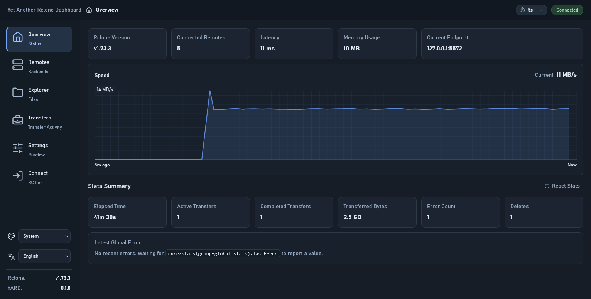
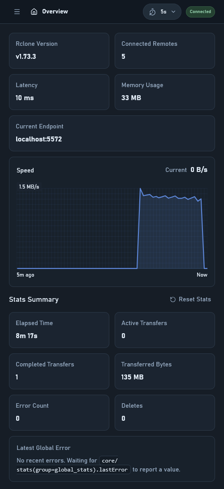
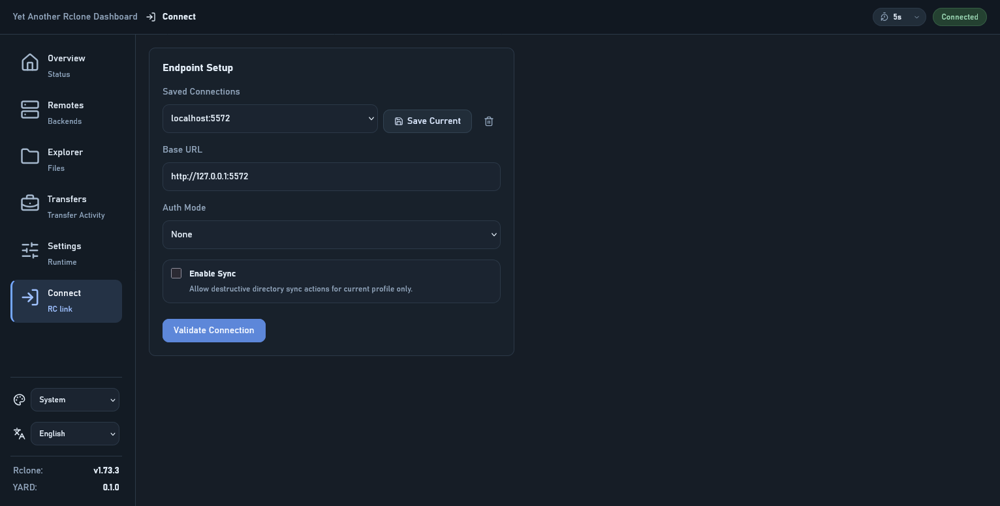
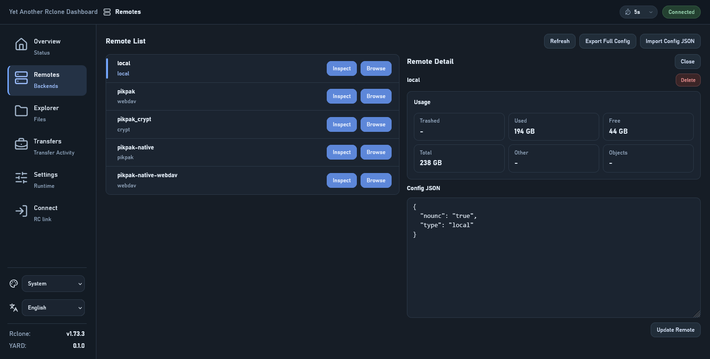
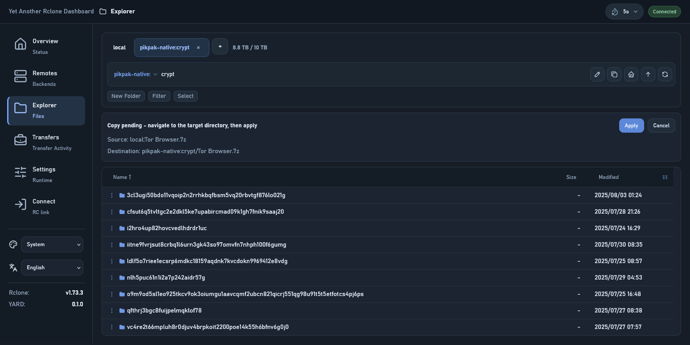
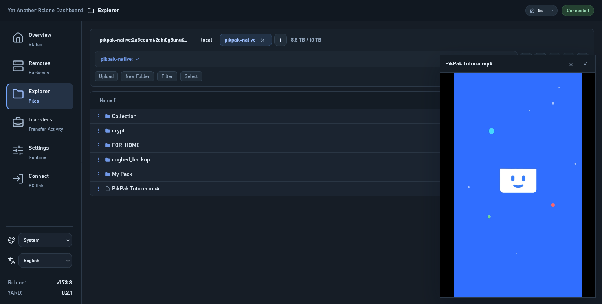
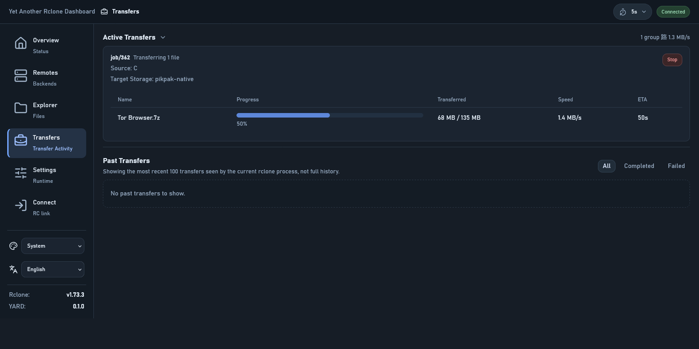
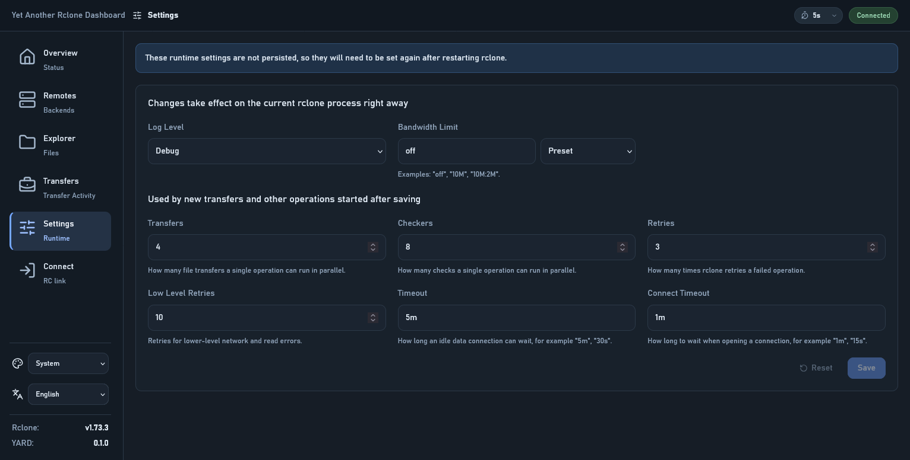

# Yet Another Rclone Dashboard

[中文说明](./docs/README.zh-CN.md)

Modern Web Dashboard for `rclone rcd` (Rclone v1.72.0 or later recommended).


<p align="center">
  
</p>

<details>
  <summary>Click to view more screenshots</summary>
  <p><strong>Mobile</strong></p>
  

  <p><strong>Connect</strong></p>
  

  <p><strong>Remotes</strong></p>
  

  <p><strong>Explorer</strong></p>
  

  <p><strong>Media Preview</strong></p>
  

  <p><strong>Transfers</strong></p>
  

  <p><strong>Settings</strong></p>
  
</details>

## Features

- connect to `rclone rcd` running in daemon mode, supporting multiple connection profiles
- inspect Rclone system information and status summary
- inspect remotes and import/export rclone configuration
- browse directories, filter, sort, and create folders
- basic media preview (requires `--rc-serve` and Rclone RC API not using Basic Auth); playback compatibility depends on your browser's decoding capabilities
- download files directly through Web interface (requires `--rc-serve` and Rclone RC API not using Basic Auth)
- upload files from local through Web interface (subject to CDN/Reverse Proxy body size or timeout limits)
- copy, sync, move, and delete files or directories
- show public links only when the backend reports native `PublicLink` support
- inspect running and completed jobs, and stop active jobs
- multiple built-in themes (Light/Dark/Vivid)
- mobile friendly
- PWA support: Installable as a standalone app on both mobile and desktop.

## Deliberate Non-Goals & Not Planned

- **Auth-derived Public Links**: For security reasons, this project does not support generating download links by deriving them from RC Basic Auth credentials.
- **Mount Management**: Mounting or unmounting remotes. These operations typically require specific OS permissions and complex lifecycle management (e.g., handling hangs or abnormal exits) in the environment where Rclone is physically running, making them unsuitable for reliable remote WebUI control.
- **Remote Configuration & Auth**: Performing complex interactive configurations (`config/create`, `config/update`) or OAuth flows. OAuth authentication is often problematic in headless environments and not suitable for remote WebUI completion.

## Quick Start

Choose one of the following methods to deploy the dashboard.

### Method 1: Using Rclone `rc-files` (Manual)

1. **Download & Prepare**: Download the latest release and extract it.
2. **Run Command**:
    <details>
    <summary><b>Desktop Environment (Local)</b></summary>

    ```bash
    rclone rcd \
      --rc-files="path/to/build" \
      --rc-no-auth \
      --rc-serve \
      --rc-addr=127.0.0.1:5572 \
      --rc-allow-origin=http://127.0.0.1:5572
    ```
    </details>

    <details>
    <summary><b>Headless / Server Environment</b></summary>

    When deploying on a remote server, ensure authentication is enabled and the origin is correctly configured: 
    ```bash
    rclone rcd \
      --rc-files="path/to/build" \
      --rc-web-gui-no-open-browser \
      --rc-user=your_user \
      --rc-pass=your_password \
      --rc-addr=0.0.0.0:5572 \
      --rc-allow-origin=http://your-server-ip:5572
    ```
    > [!TIP]
    > Set `--rc-allow-origin` to the actual URL used to access the dashboard in your browser (e.g., your domain if using a reverse proxy). 
    </details>

### Method 2: Using Rclone's WebGUI Fetcher (Automatic)

You can use Rclone's built-in fetcher to automatically download and run the latest dashboard without manual preparation.

<details>
<summary><b>Local Mode</b></summary>

```bash
rclone rcd \
  --rc-web-gui \
  --rc-web-fetch-url='https://api.github.com/repos/outlook84/yet-another-rclone-dashboard/releases/latest' \
  --rc-no-auth \
  --rc-serve \
  --rc-addr=127.0.0.1:5572 \
  --rc-allow-origin=http://127.0.0.1:5572
```
</details>

<details>
<summary><b>Remote Mode</b></summary>

```bash
rclone rcd \
  --rc-web-gui \
  --rc-web-fetch-url='https://api.github.com/repos/outlook84/yet-another-rclone-dashboard/releases/latest' \
  --rc-web-gui-no-open-browser \
  --rc-user=your_user \
  --rc-pass=your_password \
  --rc-addr=0.0.0.0:5572 \
  --rc-allow-origin=http://your-server-ip:5572
```
</details>

> [!NOTE]
> For more information on `rclone rcd` flags and options, refer to the [official rclone documentation](https://rclone.org/commands/rclone_rcd/).

### Method 3: Using Nginx or Caddy (Custom Web Server)

Since this is a static Web application, you can serve it using any standard web server.

<details>
<summary><b>Nginx Configuration</b></summary>

```nginx
server {
    listen 80;
    server_name dashboard.example.com;

    location / {
        root /path/to/extracted/build;
        index index.html;
        try_files $uri $uri/ /index.html;
    }
}
```
</details>

<details>
<summary><b>Caddy Configuration</b></summary>

```caddy
dashboard.example.com {
    root * /path/to/extracted/build
    file_server
}
```
</details>

> [!IMPORTANT]
> When using a custom web server, ensure that your Rclone instance is running with the correct `--rc-allow-origin` matching your dashboard's URL.

### Method 4: Advanced (Auth Gateway + Reverse Proxy)

This mode uses an external authentication gateway (e.g., `caddy-security`, `Authelia`, `GoAuthentik`) to handle logins and leverages Rclone’s `--rc-user-from-header` feature. This allows for secure media previews and downloads in the browser by bypassing the Basic Auth limitation.

<details>
<summary><b>Example: Caddy with caddy-security</b></summary>

**Rclone Command:**
```bash
rclone rcd \
  --rc-serve \
  --rc-files='/path/to/extracted/build' \
  --rc-user-from-header X-Remote-User \
  --rc-addr=127.0.0.1:5572 \
  --rc-allow-origin=https://rclone.dashboard
```

**Caddyfile snippet:**
```caddy
@rclone host rclone.dashboard
handle @rclone {
        authorize with admins_policy
        reverse_proxy 127.0.0.1:5572 {
                header_up X-Remote-User {http.auth.user.sub}
                header_up -Authorization
        }
}
```
</details>

## Usage

### 1. Start Rclone
Ensure your Rclone instance is running using one of the methods above.

### 2. Open Browser
Navigate to the configured address (e.g., `http://127.0.0.1:5572` or your server IP/domain) to start using the dashboard.

### 3. Keyboard Shortcuts

- Explorer list navigation:
  `ArrowUp` / `ArrowDown` move the active row, `Home` jumps to the first row, `End` jumps to the last row, and `PageUp` / `PageDown` move by one visible page.
- Explorer row actions:
  `Enter` opens the active directory, `Ctrl+Enter` opens the active row action menu, `Backspace` goes to the parent directory, and `Delete` deletes the active row or current selection after confirmation.
- Explorer transient UI:
  `Esc` closes Explorer-local transient UI first, including the row action menu, path editing state, and directory summary panel.
- Media preview:
  `Space` toggles play / pause for audio and video previews, and `Esc` minimizes the preview.
- Upload center:
  `Esc` collapses the upload center when it is open.

## Credits

Application icon artwork, including the favicon and bundled PWA icons, is derived from Noto Emoji. See [LICENSES/Noto-Emoji-LICENSE.txt](./LICENSES/Noto-Emoji-LICENSE.txt) for the bundled license text.
