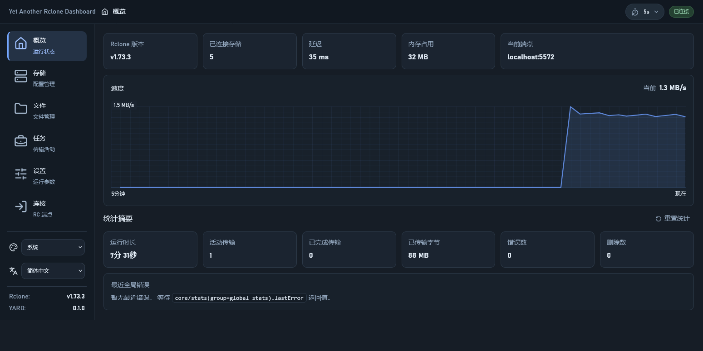
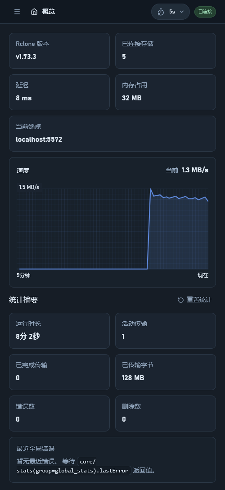
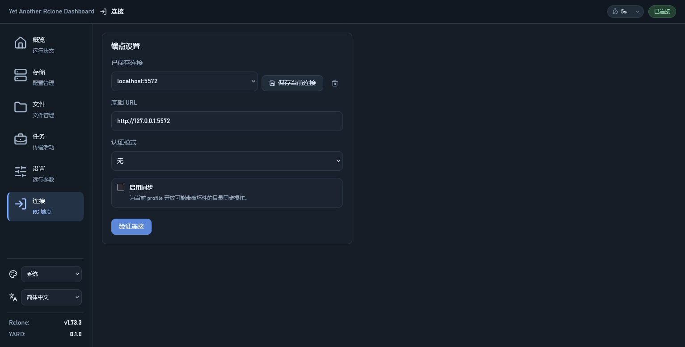
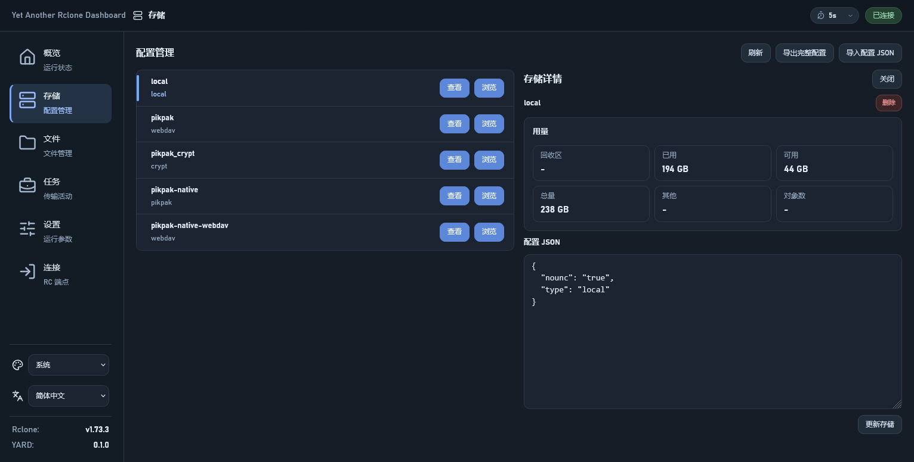
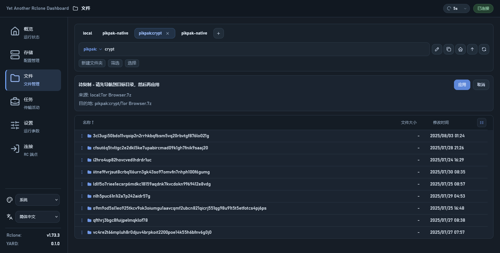
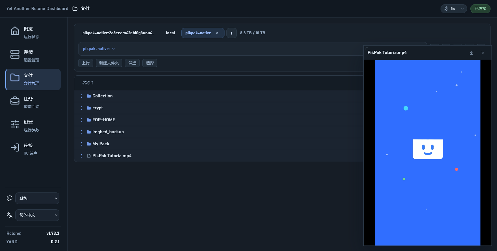
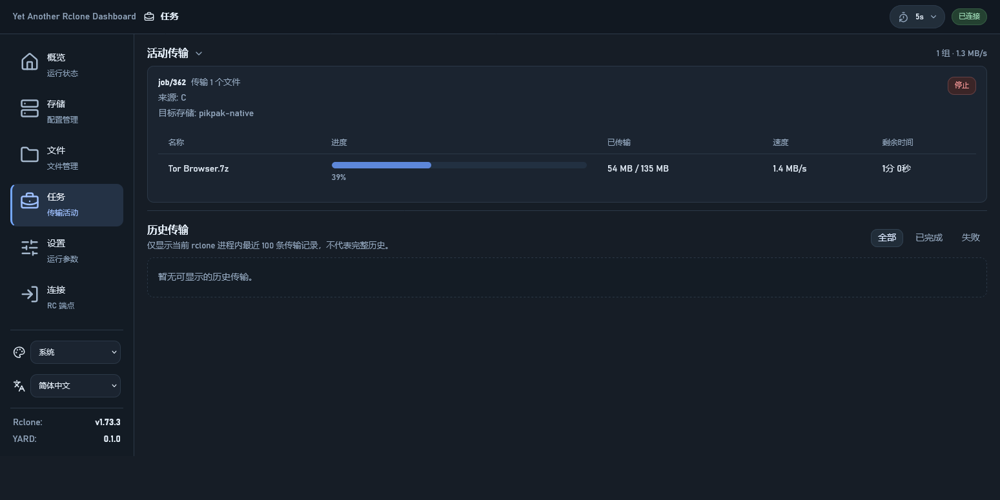
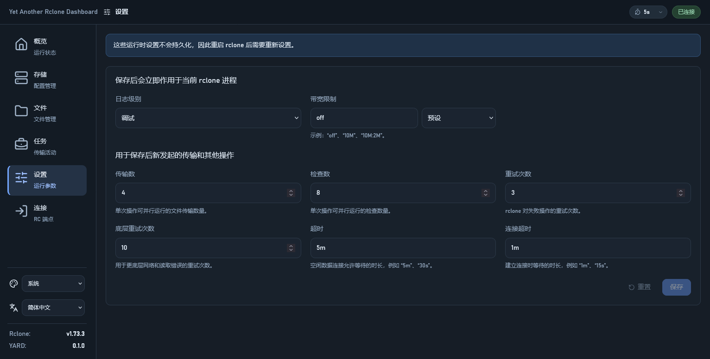

# Yet Another Rclone Dashboard

[English README](../README.md)

面向 `rclone rcd` 的现代 Web 面板（推荐配合 Rclone v1.72.0 及以上版本使用）。


<p align="center">
  
</p>

<details>
  <summary>点击查看更多截图</summary>
  <p><strong>移动端 (Mobile)</strong></p>
  

  <p><strong>连接 (Connect)</strong></p>
  

  <p><strong>存储列表 (Remotes)</strong></p>
  

  <p><strong>文件浏览 (Explorer)</strong></p>
  

  <p><strong>媒体预览 (Media Preview)</strong></p>
  

  <p><strong>任务状态 (Transfers)</strong></p>
  

  <p><strong>设置 (Settings)</strong></p>
  
</details>

## 功能概览

- 连接到以 daemon 模式运行的 `rclone rcd`，并支持保存多个连接配置 (profiles)
- 查看 Rclone 基本信息与统计摘要
- 查看 remotes 以及导入/导出 rclone 配置
- 浏览目录、筛选、排序、创建目录
- 基础的媒体预览功能（前提为开启 `--rc-serve` 且 Rclone RC API 未启用 Basic Auth 认证），播放能力取决于浏览器的解码支持
- 通过 Web 界面下载文件（前提为开启 `--rc-serve` 且 Rclone RC API 未启用 Basic Auth 认证）
- 从本地通过 Web 界面上传文件（受 CDN/反向代理等网络环境的请求体大小或超时限制）
- 复制、同步、移动、删除文件或目录
- 在后端原生支持 `PublicLink` 时显示分享链接
- 查看运行中与历史任务，停止运行中的任务
- 多种内置主题 (Light/Dark/Vivid)
- 移动端友好

## 非开发目标与限制

- **基于认证推导的公开链接**：出于安全考虑，不提供生成基于 RC Basic Auth 凭据的下载链接。
- **挂载管理 (Mount/Unmount)**：在 WebUI 中远程执行挂载操作。挂载往往需要在 Rclone 运行的实际宿主环境中处理复杂的权限问题、异常退出后的清理等，不适合通过远程 Web 界面进行操作。
- **远程配置与认证**：通过复杂的交互式表单或 OAuth 流程执行 `config/create` 等远程配置操作。OAuth 流程在无头 (headless) 环境下不适合通过 Web 界面远程完成。

## 快速开始

本项目是纯静态 Web 应用。你可以选择以下任一方式进行部署。

### 方式 1：使用 Rclone `rc-files` 参数（手动部署）

1. **下载与准备**：下载最新 Release 并解压。
2. **启动命令**：
    <details>
    <summary><b>桌面环境 (本地运行)</b></summary>

    ```bash
    rclone rcd \
      --rc-files="path/to/build" \
      --rc-no-auth \
      --rc-serve \
      --rc-addr=127.0.0.1:5572 \
      --rc-allow-origin=http://127.0.0.1:5572
    ```
    </details>

    <details>
    <summary><b>服务器 / 无头 (Headless) 环境</b></summary>

    在远程服务器部署时，请务必开启认证并配置正确的访问地址：
    ```bash
    rclone rcd \
      --rc-files="path/to/build" \
      --rc-web-gui-no-open-browser \
      --rc-user=your_user \
      --rc-pass=your_password \
      --rc-addr=0.0.0.0:5572 \
      --rc-allow-origin=http://your-server-ip:5572
    ```
    > [!TIP]
    > `--rc-allow-origin` 应当配置为浏览器实际访问该控制台的 URL（例如通过反向代理访问时的域名）。
    </details>

### 方式 2：利用 Rclone 内置 WebGUI 功能（自动部署）

你也可以直接利用 Rclone 内部抓取功能来加载 WebGUI，省去手动下载步骤。

<details>
<summary><b>本地模式</b></summary>

```bash
rclone rcd \
  --rc-web-gui \
  --rc-web-fetch-url='https://api.github.com/repos/outlook84/yet-another-rclone-dashboard/releases/latest' \
  --rc-no-auth \
  --rc-serve \
  --rc-addr=127.0.0.1:5572 \
  --rc-allow-origin=http://127.0.0.1:5572
```
</details>

<details>
<summary><b>远程模式</b></summary>

```bash
rclone rcd \
  --rc-web-gui \
  --rc-web-fetch-url='https://api.github.com/repos/outlook84/yet-another-rclone-dashboard/releases/latest' \
  --rc-web-gui-no-open-browser \
  --rc-user=your_user \
  --rc-pass=your_password \
  --rc-addr=0.0.0.0:5572 \
  --rc-allow-origin=http://your-server-ip:5572
```
</details>

> [!NOTE]
> 更多关于 `rclone rcd` 的参数说明，请参考 [rclone 官方文档](https://rclone.org/commands/rclone_rcd/)。

### 方式 3：使用 Nginx 或 Caddy 部署（自定义服务器）

本项目是纯静态 Web 应用，你可以使用任何标准 Web 服务器进行托管。

<details>
<summary><b>Nginx 配置示例</b></summary>

```nginx
server {
    listen 80;
    server_name dashboard.example.com;

    location / {
        root /path/to/extracted/build;
        index index.html;
        try_files $uri $uri/ /index.html;
    }
}
```
</details>

<details>
<summary><b>Caddy 配置示例</b></summary>

```caddy
dashboard.example.com {
    root * /path/to/extracted/build
    file_server
}
```
</details>

> [!IMPORTANT]
> 使用自定义 Web 服务器时，请确保 Rclone 实例运行时设置了正确的 `--rc-allow-origin`，使其匹配你访问面板的 URL。

### 方式 4：高级部署（认证网关 + 反向代理）

这种模式通过外部认证网关（如 `caddy-security`、`Authelia`、`GoAuthentik` 等）处理登录，并利用 Rclone 的 `--rc-user-from-header` 功能。这可以在保证安全的同时，解决 Basic Auth 对视频预览和下载的限制。

<details>
<summary><b>示例：Caddy 配合 caddy-security</b></summary>

**Rclone 启动命令：**
```bash
rclone rcd \
  --rc-serve \
  --rc-files='/path/to/extracted/build' \
  --rc-user-from-header X-Remote-User \
  --rc-addr=127.0.0.1:5572 \
  --rc-allow-origin=https://rclone.dashboard
```

**Caddyfile 示例：**
```caddy
@rclone host rclone.dashboard
handle @rclone {
        authorize with admins_policy
        reverse_proxy 127.0.0.1:5572 {
                header_up X-Remote-User {http.auth.user.sub}
                header_up -Authorization
        }
}
```
</details>

## 使用说明

### 1. 启动 Rclone
确保你已按照上述任一方式启动了 Rclone 实例。

### 2. 访问
在浏览器打开配置的地址（如 `http://127.0.0.1:5572` 或你的服务器 IP/域名）即可开始使用。

## 鸣谢

Favicon 图标基于 Noto Emoji 资源制作。随仓库附带的授权文本见 [LICENSES/Noto-Emoji-LICENSE.txt](../LICENSES/Noto-Emoji-LICENSE.txt)。
